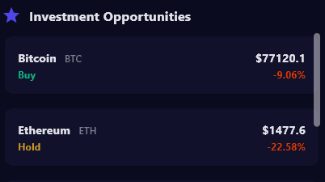
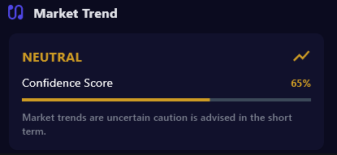

# 🧠 Crypto AI Analyst

A Python application that uses AI to analyze cryptocurrency news and provide insights, sentiment analysis, market trends, and investment recommendations.

---

## 🚀 Features

- 🔍 Fetches real-time crypto news from **CryptoPanic**.
- 📊 Retrieves price data from **CoinMarketCap**.
- 🤖 Uses **OpenAI GPT** to analyze news articles and provide:
  - Summary of news impact on Bitcoin, Ethereum, and altcoins.
  - Sentiment for each top article.
  - Suggested cryptocurrencies to invest in.
  - Overall market trend analysis (Bullish/Bearish/Neutral).

---

## ⚙️ Installation

### Clone the Repository

```bash
git clone https://github.com/yourusername/crypto-ai-analyst.git
cd crypto-ai-analyst
```

### Install Dependencies with Pipenv

```bash
pip install pipenv
pipenv install
pipenv shell
```

---

## 🔑 Set Up Environment Variables

### Create a .env file in the root directory of the project

- OPENAI_API_KEY=your_openai_api_key
- OPENAI_API_ENDPOINT=https://api.openai.com/v1
- CRYPTO_PANIC_API_KEY=your_crypto_panic_api_key
- COIN_MARKET_CAP_API_KEY=your_coinmarketcap_api_key

---

## ▶️ Running the App

```bash
flet run main.py
```

## App Screenshots






